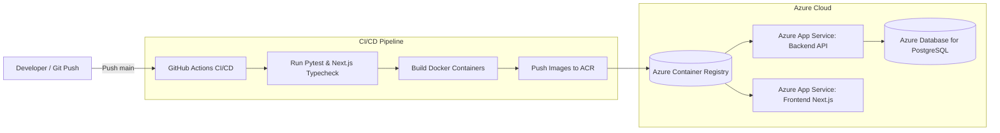

# Deployment Guide: Azure App Service & CI/CD Pipeline

This guide details how to deploy the **AI Agent Dashboard 2026** to **Microsoft Azure** using Docker containers, Azure Container Registry (ACR), and GitHub Actions.

---

## Architecture Overview



---

## 1. Prerequisites

- [Azure CLI (`az`)](https://learn.microsoft.com/en-us/cli/azure/install-azure-cli) installed and authenticated.
- Azure subscription with permissions to create Resource Groups, App Services, and Container Registries.
- A GitHub repository with repository Admin access to add secrets.

---

## 2. Step-by-Step Azure Resource Provisioning

### Step 2.1: Define Variables & Create Resource Group

```bash
# Variables
RESOURCE_GROUP="rg-ai-dashboard-prod"
LOCATION="eastus"
ACR_NAME="acraidashboard$RANDOM"
PLAN_NAME="plan-ai-dashboard"
BACKEND_APP="app-ai-dashboard-api"
FRONTEND_APP="app-ai-dashboard-web"

# Create Resource Group
az group create --name $RESOURCE_GROUP --location $LOCATION
```

### Step 2.2: Create Azure Container Registry (ACR)

```bash
# Create ACR
az acr create \
  --resource-group $RESOURCE_GROUP \
  --name $ACR_NAME \
  --sku Standard \
  --admin-enabled true

# Retrieve ACR credentials
ACR_USERNAME=$(az acr credential show --name $ACR_NAME --query "username" -o tsv)
ACR_PASSWORD=$(az acr credential show --name $ACR_NAME --query "passwords[0].value" -o tsv)
```

### Step 2.3: Create App Service Plan (Linux)

```bash
az appservice plan create \
  --name $PLAN_NAME \
  --resource-group $RESOURCE_GROUP \
  --is-linux \
  --sku B1
```

### Step 2.4: Create Backend Web App (Container)

```bash
az webapp create \
  --resource-group $RESOURCE_GROUP \
  --plan $PLAN_NAME \
  --name $BACKEND_APP \
  --deployment-container-image-name "$ACR_NAME.azurecr.io/ai-agent-backend:latest"

# Configure Application Settings (Environment Variables)
az webapp config appsettings set \
  --resource-group $RESOURCE_GROUP \
  --name $BACKEND_APP \
  --settings \
    WEBSITES_PORT=8000 \
    DATABASE_URL="sqlite:///./usage.db" \
    API_KEY="your-secure-production-api-key" \
    CORS_ORIGINS='["https://'$FRONTEND_APP'.azurewebsites.net"]'
```

> **Note on PostgreSQL:** To use Azure Database for PostgreSQL Flexible Server, provision the database and set `DATABASE_URL="postgresql://<user>:<password>@<server>.postgres.database.azure.com:5432/<dbname>?sslmode=require"`.

### Step 2.5: Create Frontend Web App (Container)

```bash
az webapp create \
  --resource-group $RESOURCE_GROUP \
  --plan $PLAN_NAME \
  --name $FRONTEND_APP \
  --deployment-container-image-name "$ACR_NAME.azurecr.io/ai-agent-frontend:latest"

# Configure Frontend Settings
az webapp config appsettings set \
  --resource-group $RESOURCE_GROUP \
  --name $FRONTEND_APP \
  --settings \
    WEBSITES_PORT=3000 \
    NEXT_PUBLIC_API_URL="https://$BACKEND_APP.azurewebsites.net"
```

---

## 3. GitHub Actions CI/CD Configuration

### Step 3.1: Create Azure Service Principal for GitHub

```bash
SUBSCRIPTION_ID=$(az account show --query id -o tsv)

az ad sp create-for-rbac \
  --name "sp-ai-dashboard-github" \
  --role contributor \
  --scopes /subscriptions/$SUBSCRIPTION_ID/resourceGroups/$RESOURCE_GROUP \
  --sdk-auth
```

This returns a JSON object. Copy the full JSON output.

### Step 3.2: Configure GitHub Repository Secrets

Navigate to **Settings > Secrets and variables > Actions** in your GitHub repository and add:

| Secret Name | Description / Value |
| :--- | :--- |
| `AZURE_CREDENTIALS` | Full JSON output from the `az ad sp create-for-rbac` command |
| `AZURE_ACR_NAME` | The ACR name (e.g. `acraidashboard...`) |
| `ACR_USERNAME` | The admin username for ACR |
| `ACR_PASSWORD` | The admin password for ACR |
| `AZURE_BACKEND_APP_NAME` | `app-ai-dashboard-api` |
| `AZURE_FRONTEND_APP_NAME` | `app-ai-dashboard-web` |

---

## 4. Triggering Deployment

Every push to the `main` branch automatically triggers `.github/workflows/deploy-azure.yml`:
1. Executes backend `pytest` unit tests.
2. Executes frontend strict TypeScript type checking (`tsc --noEmit`) and production Next.js build.
3. Builds Docker containers for backend and frontend.
4. Pushes images to ACR tagged with commit SHA and `latest`.
5. Deploys updated containers to the Azure App Service instances with zero-downtime container swaps.

---

## 5. Verifying Deployed Services

- **Backend Health Check:** `https://app-ai-dashboard-api.azurewebsites.net/health`
- **Backend Swagger OpenAPI Docs:** `https://app-ai-dashboard-api.azurewebsites.net/docs`
- **Frontend Dashboard:** `https://app-ai-dashboard-web.azurewebsites.net`
- **Stream Verification (SSE):** `curl -N https://app-ai-dashboard-api.azurewebsites.net/api/usage/events`
